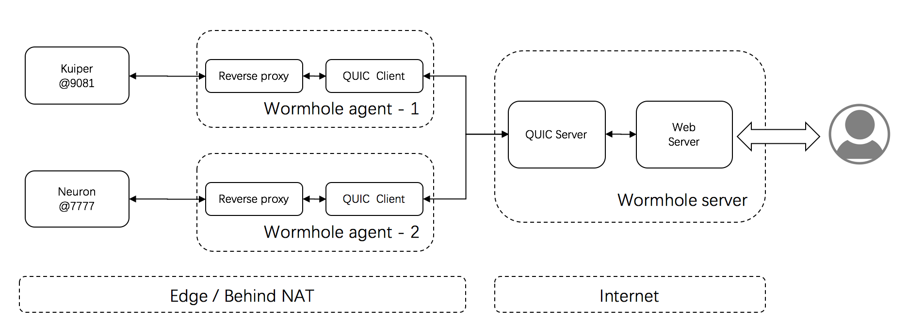

# Wormhole
The project provides a channel for routing HTTP requests from cloud to edge, it can bridge server and clients behind NAT. The channel is based on QUIC protocol, it has better performance if client network is not very stable, and fit for the IoT scenarios.

## How it works?

Cloud side cannot access the services deployed behind NAT, because the port and services are not exposed to Internet. Wormhole provides a channel based on QUIC protocol, and the QUIC connection is initiated from client agent. After the QUIC connection is established, any HTTP request issued from end-user will be rediected to agent. After getting result from target service, the response is sent back to end-user by the underneath QUIC connection.

Below is a scenario,

- A [Kuiper server](https://github.com/emqx/kuiper) is deployed in edge gateway named `agent1`, and it can be only accessed from localhost - http://127.0.0.1:9081/stream.
- An application is deployed at cloud,  and suppose it can be access from http://manager.emqx.io/. Now we want to expose the previous Kuiper services through http://manager.emqx.io/.

The call sequence is as in below:

1. End user send an HTTP GET request `http://manager.emqx.io/agent1/stream`.
2. Wormhole server encodes HTTP request, and send it to `agent1` through QUIC channel.
3. Agent app is running in the same device with Kuiper service, then agent sends request to real target server - `http://127.0.0.1:9081/stream`.
4. Agent app send HTTP response back to server through QUIC channel.
5. Server send result back to end user.

### Getting start

- [Getting start doc](docs/getting_start.md)

## Open source license

[Apache 2.0](https://github.com/emqx/kuiper/blob/master/LICENSE)